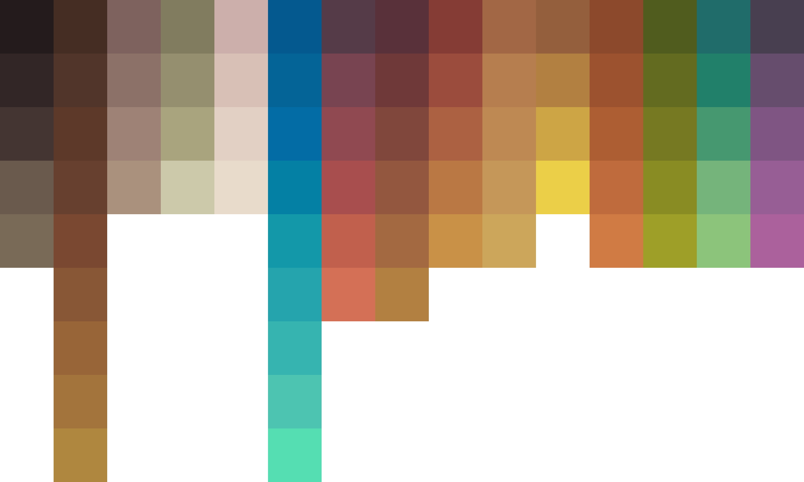

Lumio
=====

### Description
Lumio is a warm pastel color palette focuses to create a steamed, but colorful comic-like ambiance.
Optimized for game- and graphic design projects.

### Related Projects
  - [Lumio - Java](https://github.com/arcticicestudio/lumio-java)

### File Formats
**Non-Native**
  - Sass `.scss`
  - LESSCSS `.less`
  - JSON `.json`
  - XML `.xml`

**Native**
  - GIMP/Inkscape Palette `.gpl`
  - Adobe Swatch Exchange `.ase`
  - Alias/WaveFront Material `.mtl`
  - Gpick Color Palette `.gpa`

### Version
[`0.0.0`](https://github.com/arcticicestudio/lumio/releases/latest)

For older versions check out the [GitHub Repository](https://github.com/arcticicestudio/lumio).

### Changelog
[`0.0.0`](CHANGELOG.md)

### Development
#### Workflow
This project follows the [git-flow](http://nvie.com/posts/a-successful-git-branching-model) branching model.

#### Specifications
This project follows the [Arctic Versioning Specification (ArcVer)](https://github.com/arcticicestudio/arcver).

### Dependencies
#### Development
**Skeletons**
  - [`glacier-git@0.18.0`](https://github.com/arcticicestudio/glacier-git)

### Contribution
Please report issues/bugs, suggestions for improvements and feature requests to the [issuetracker](https://github.com/arcticicestudio/lumio/issues).

### Author
[Lumio](https://github.com/arcticicestudio/lumio) is developed and authored by [Arctic Ice Studio](http://arcticicestudio.com).

### Copyright
Copyright (C) 2015-2016 Arctic Ice Studio <development@arcticicestudio.com>

### License
 

---

### References
  - [Lumio]((https://github.com/arcticicestudio/lumio)
  - [Sass](http://sass-lang.com)
  - [LESSCSS](http://lesscss.org)  
  - [Glacier - Git](https://github.com/arcticicestudio/glacier-git)  
